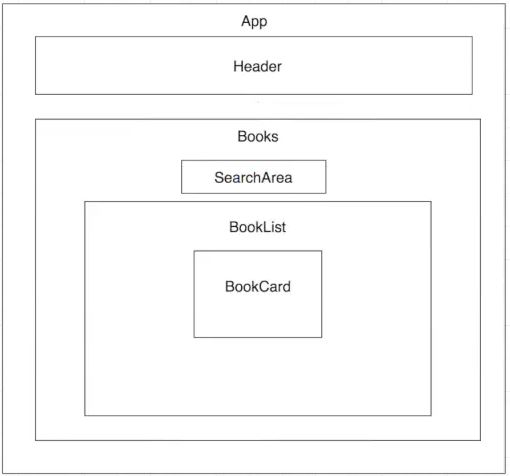

## Google Books Search

# What it does:

This app uses the components illustrated below to search Google Books for any book they may be interested in.  The app uses a sorting function to allow the user to sort results based on the year the book was published.

# Technologies Used:

- Node.js
- React
- npm packages:
   -superagent
   -react-router-dom
   
 
